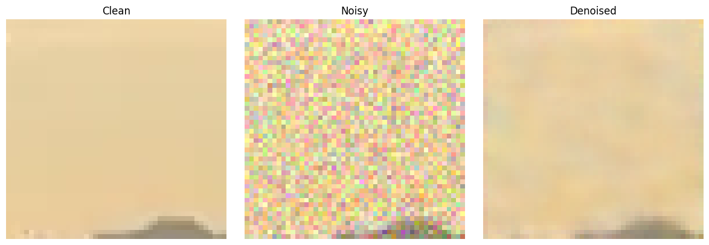
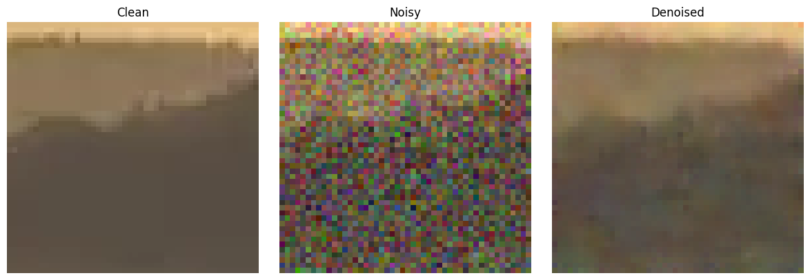
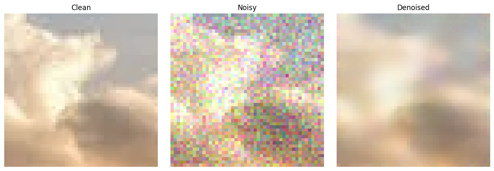

# 🧼 CNN Image Denoiser (PyTorch)

This project implements a lightweight convolutional neural network (CNN) for image denoising, trained on synthetic Gaussian noise. Built with PyTorch, it uses residual learning to predict the noise component and efficiently reconstruct clean images.

Developed as an academic collaboration between **Yashar Meidani** and **Amin Taheri**.

---
## 🖼️ Visual Results

### 🔧 Input Noisy Image


### 🧼 Denoised Output



### 🧪 Unseen Example



## 📌 Features

- 🔁 **Residual Learning** – The model learns to predict noise, not the clean image
- 🧠 **Custom CNN Architecture** – Bottleneck-style design with 10 convolutional layers
- 📦 **Patch-based Data Loader** – Random 48×48 crops with controllable Gaussian noise
- 🚀 **Mixed Precision Training** – Faster training via PyTorch AMP (optional)
- 📊 **Evaluation Pipeline** – Reports PSNR and SSIM on unseen noisy images
- 🖼️ **Visualization Script** – Side-by-side plots: clean vs noisy vs denoised

---

## 🧠 Architecture

```

Input
↓
Conv(3→mid) → ReLU
↓
\[Bottleneck Block × depth] → Conv(mid→3)
↓
Output (Noisy + Residual)

```

- **Depth:** Default = 4 blocks → 10 Conv layers
- **Residual Learning:** Output = Noisy + predicted noise

---


---

## 🛠️ Installation

```bash
pip install torch torchvision matplotlib torchmetrics
````

---

## 🏁 Usage

### 🔧 Training

```bash
python src/train.py
```

Or run with a config object:

```python
from argparse import Namespace

cfg = Namespace(
    data_root = Path("data"),
    sigma = 25,
    batch_size = 128,
    epochs = 10,
    lr = 1e-3,
    val_split = 0.2,
    workers = 4,
    out_dir = Path("weights"),
    seed = 42,
    patience = 5,
    amp = True
)

main(cfg)
```

---

### 🧪 Evaluation

```bash
python src/eval.py
```

Edit the `cfg` inside `eval.py` to point to your weights and data.

---

### 📷 Visualization

```bash
python src/visualize.py
```

Will display side-by-side: Clean | Noisy | Denoised

---

## 📄 License

MIT License
© 2025 Yashar Meidani & \[Friend's Full Name]

---


